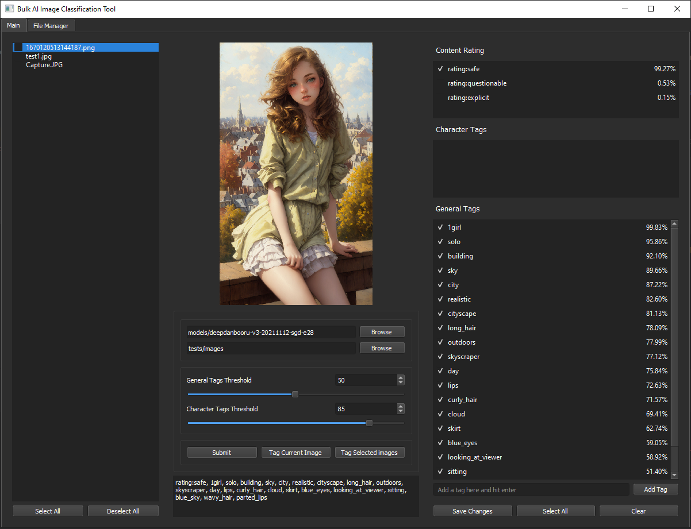

# Bulk AI Image Classification Tool

Bulk image tagger for onnx runtime 



## Installation and Running
### Prerequisites
+ Python 3.9 - 3.11
+ Windows 10/11

### Building from source
Assuming you've already set up the virtual environment
```bash
pip install -r requirements.txt
pip install .
python main.py
```

- Models and tags are loaded via action_box's load_model and load_tags function, which look for the above files respectively

## Usage
### Generating Tags
#### Warning: once you submit it **cannot** be cancelled.
1. Load model using the browse button located at next to the input that says model.
2. Specify folder path, does not tag subdirectories.
3. Specify threshold limits. Tags are based on probability of correctness, if probability is greater than threshold then that tag is added to results. This is based on the model provided.
4. Click Submit to generate tags for all images. 

### Editing Tags
#### Adding tags
- Don't see a tag in results? Type it in the add tag box and hit enter.
#### Removing Tags
- Uncheck the tag you don't want and then click 'Save Changes'
#### Writing Tags to Exif
- Tag current image: writes tags to the currently displayed image
- Tag selected images: writes tags to the all images checked in the filelist to the left

